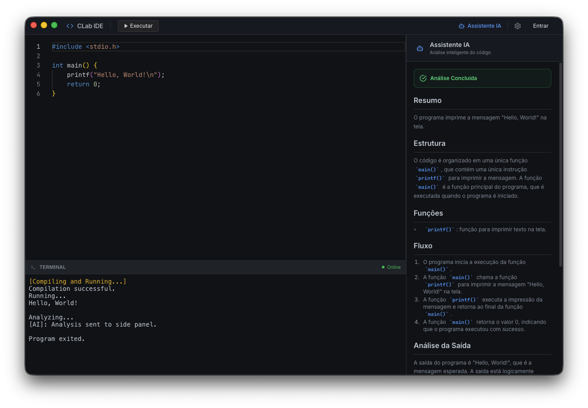
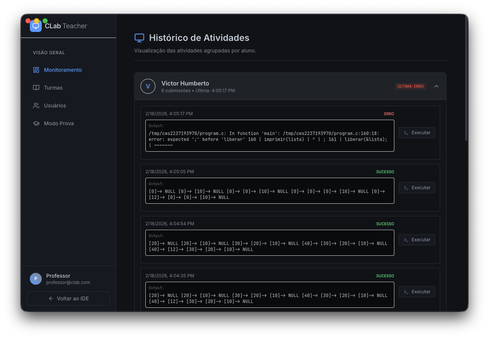

<p align="center">
  <h1 align="center">🧪 CLab IDE e Ecossistema</h1>
  <p align="center">
    <strong>Plataforma Integrada para o Ensino da Linguagem C com Assistência de IA</strong>
  </p>
  <p align="center">
    O <strong>CLab</strong> propõe um ambiente de desenvolvimento e ensino focado em escalabilidade e segurança. O sistema abstrai a complexidade de configuração de laboratórios através de um modelo distribuído, provendo uma IDE leve conectada a um servidor de compilação remota isolado, integrado com análise estática e Inteligência Artificial.
  </p>
  <p align="center">
    
    
    
    
  </p>
</p>

---

## 🌟 Visão Geral do Projeto

O **CLab** é um ecossistema de desenvolvimento e gestão acadêmica concebido para mitigar barreiras técnicas no ensino de linguagens compiladas. Ao unir uma IDE moderna ao processamento centralizado e à inteligência artificial, o projeto otimiza a produtividade discente e a administração docente, solucionando um gargalo comum na infraestrutura educacional: a padronização de ambientes de laboratório.

---

## 💡 O Conceito: Compilação Centralizada (Zero-Config)

Em distinção aos ambientes de desenvolvimento locais que demandam a instalação e configuração de compiladores específicos por máquina, o CLab fundamenta-se em uma arquitetura **Client-Server**.

- **Eficiência Computacional:** O discente interage com uma aplicação leve desenvolvida em Electron, transferindo o processamento e a execução do código de alto desempenho para um servidor centralizado.
- **Resolução de Conflitos de Ambiente:** O modelo centralizado suprime a necessidade de configurar variáveis de sistema e administrar dependências em computadores de laboratório compartilhados entre múltiplos cursos.
- **Padronização Acadêmica:** Assegura a integridade do processo de avaliação, onde todos os alunos compilam sob a exata mesma infraestrutura, binários e bibliotecas.

---

## 🛠️ Pilares Funcionais

1. **Ensino Assistido:** Integração com LLMs locais (como LLaMA ou phi3) que operam como tutores acadêmicos. O sistema processa saídas de erro do compilador (ex: falhas de segmentação) e fornece orientações construtivas baseadas na lógica do código.
2. **Segurança em Sandbox:** Todo tráfego de código originado no cliente é interceptado e executado em um ambiente estritamente não privilegiado, garantido por sandboxing via Firejail em conjunto com containers Docker. Isso resguarda o servidor contra processos zumbis, consumo excessivo de recursos ou execuções maliciosas.
3. **Gestão e Monitoramento Síncrono:** Módulos integrados ("Student" e "Teacher") comunicam-se de modo bidirecional via WebSockets. Permite ao docente monitorar o progresso individual e coletivo dos estudantes em tempo real, gerenciar métricas e impor restrições sistêmicas (ex: inativação da IA e limpeza de logs durante avaliações).

---

## 🏗️ Estrutura Arquitetural

- **Frontend (Apresentação):** Implementado em React.js (via Next.js) e documentado por TailwindCSS, empacotado para distribuição multiplataforma via Electron.
- **Backend (Engine):** API RESTFUL e serviço WebSocket de alta disponibilidade desenvolvidos em Go (framework Gin), projetado para concorrência eficiente e orquestração de compilações.
- **Persistência de Dados:** Banco de dados relacional (PostgreSQL) para armazenamento íntegro de métricas de desempenho, submissões e mapeamento de turmas.
- **Motor de Execução:** Isolações locais garantidas pelo Firejail operando no nível do kernel Linux e orquestrado por instâncias Docker.

---

## 📸 Experiência do Usuário (UX) e Interfaces

### 🖥️ Espaço de Trabalho do Discente (Workspace)



> **Ambiente de Desenvolvimento (IDE):** Interface construída com **Monaco Editor** e terminal interativo via WebSockets. No painel lateral, a IA atua em tempo real analisando o código, ajudando com erros de compilação sintáticos sem dar a resposta pronta.

---

### 👩‍🏫 Painel de Controle Docente

#### Monitoramento Síncrono



> **Monitoramento da Turma:** O professor tem uma visão completa da sala de aula em tempo real. O painel permite ver quem está com erro e até interagir remotamente com o código dos alunos para ajudar diretamente.

#### Correção Automática (IA)


> **Automação de Notas:** Na entrega, a IA compara o output (`STDOUT`) construído pelo aluno com o output do teste (Expected Output). Ela entende a lógica, pontua automaticamente e escreve um feedback que o professor pode aceitar, editar ou descartar.

---

### 🛡️ Ambiente Restrito de Avaliação (Modo Prova)


> **Segurança Acadêmica:** Quando uma prova ou avaliação é iniciada, a IDE entra em Modo Bloqueio. A IA de tutoria é desativada e a interface fica focada apenas no enunciado, reduzindo distrações e garantindo integridade no processo de avaliação.

---

## 🚀 Funcionalidades Sistêmicas

| Módulo                     | Descrição                                                                                              |
| :------------------------- | :----------------------------------------------------------------------------------------------------- |
| **Sandbox & Compilação**   | O código do aluno é isolado usando Firejail + Docker no servidor, evitando loops e Syscalls perigosos. |
| **IA Local Integrada**     | O recurso usa LLaMA ou phi através do Ollama rodando localmente (sem custo de cloud).                  |
| **Terminal de Automação**  | Suporte verdadeiro a `scanf` e `fgets` através de streams por WebSocket, sem atrasos.                  |
| **Sincronização Contínua** | Os arquivos e avanços dos alunos são permanentemente salvos e restaurados na troca de sessões.         |
| **Gestão Acadêmica**       | Separação por turmas (Admin/Teacher/Student), facilitando o manuseio de exercícios.                    |

---

## 🔬 Deep Dive Técnico

O fluxo de dados e compilação do CLab minimiza a latência enquanto maximiza a segurança. O processo pode ser dividido em três pipelines robustamente isolados:

### 1. The Compilation Lifecycle (Go + Firejail)

Quando um estudante aciona a execução do código (Run), as seguintes rotinas são orquestradas no Backend:

1. Um **Goroutine worker** intercepta a requisição via API HTTP e aloca um espaço seguro `tmp` efêmero mapeado em um PID restrito.
2. O servidor injeta o arquivo `.c` e aciona o sub-processo `firejail --quiet --net=none --private=tmpdir`. Isso desabilita virtualmente o barramento de rede e empacota o usuário em diretórios de chroot temporários.
3. A chamada do compilador hospedeiro (`gcc`) converte o artefato em binário, aplicando restrições de limite de processamento de CPU (`ulimit`) e memória com base em flags definidas. O timeout duro de execução (ex: 3s) evita bloqueios do _Event Loop_ (loops infinitos).

### 2. Stream de Alta Responsividade (WebSockets)

A natureza assíncrona da execução interativa (ex: um programa esperando a entrada via `scanf`) não comporta o protocolo HTTP unívoco convencional. Para isso:

- O painel discente monta um terminal utilizando **XTerm.js**, estabelecendo uma sessão persistente com o módulo `ws` no Go.
- Quando o serviço C requer entrada, a goroutine paralisa a stream do sub-processo (`STDIN`) e sinaliza o WebClient. O pacote trafega nos frames do WebSocket para dentro do buffer reservado do Firejail, fluindo como se a execução daquele binário não estivesse há quilômetros de distância.

### 3. Pipeline de Avaliação Inteligente

O fluxo da inferência local opera processamento cognitivo desprovido das latências típicas da nuvem:

1. **Parser de Exceções**: Se o `gcc` reportar status != 0, o _stderr_ bruto é envelopado em um prompt sistêmico otimizado, pedindo não o _fix_ exato, mas pistas pedagógicas baseadas nas falhas de segmentação ou de tipos da norma C99.
2. **Avaliação Semântica (LLM-Assisted Grading)**: Na entrega da prova, o LLaMA/phi analisa se o algoritmo atende a complexidade imposta ou se ele trapaceia "chumbando/hardcoding" condicionais (ex: validando que não ocorra apenas `if (x == 5) return 2;`). O tutor reporta o _score_ inferível diretamente na base PostgreSQL via GORM.

## 🛠️ Arquitetura do Sistema

O **CLab Client** é apenas a ponta do iceberg. Ele se comunica com o **CLab Server**, uma poderosa engine em Go.

```mermaid
graph LR
    A[CLab Client (Electron)] -- WebSocket/HTTP --> B[CLab Server (Go)]
    B -- Firejail --> C[Sandbox (Execução Segura)]
    B -- HTTP --> D[Ollama (IA Local)]
    B -- SQL --> E[Banco de Dados]
```

---

## 🏁 Começando

### Pré-requisitos

Para a experiência completa, você precisará do ecossistema:

1.  **Node.js** 18+ (Front-end)
2.  **CLab Server** rodando (Back-end & Compilador) - [Obter o Server](https://github.com/VictorHumberto01/CLabServer)
3.  **Ollama** (Opcional, para recursos de IA)

### Instalação

```bash
# 1. Clone o Front-end
git clone https://github.com/VictorHumberto01/CLab_Client.git
cd CLab_Client

# 2. Instale dependências
npm install

# 3. Inicie o desenvolvimento
npm run electron-dev
```

---

## 📝 Licença

Copyright © 2026 Victor Humberto. Todos os direitos reservados.
