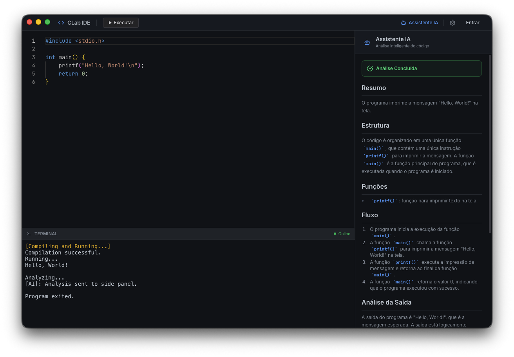
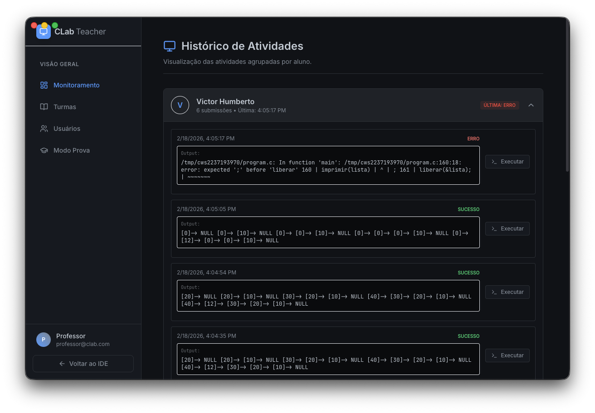

<p align="center">
  <h1 align="center">🧪 CLab IDE e Ecossistema</h1>
  <p align="center">
    <strong>Plataforma Integrada para o Ensino da Linguagem C com Assistência de IA</strong>
  </p>
  <p align="center">
    O <strong>CLab</strong> propõe um ambiente de desenvolvimento e ensino focado em escalabilidade e segurança. O sistema abstrai a complexidade de configuração de laboratórios através de um modelo distribuído, provendo uma IDE leve conectada a um servidor de compilação remota isolado, integrado com análise estática e Inteligência Artificial.
  </p>
  <p align="center">
    
    
    
    
  </p>
</p>

---

## 🌟 Visão Geral do Projeto

O **CLab** é um ecossistema de desenvolvimento e gestão acadêmica concebido para mitigar barreiras técnicas no ensino de linguagens compiladas. Ao unir uma IDE moderna ao processamento centralizado e à inteligência artificial, o projeto otimiza a produtividade discente e a administração docente.

---

## 💡 O Conceito: Compilação Centralizada (Zero-Config)

- **Eficiência Computacional:** O discente interage com uma aplicação leve em Electron; o processamento ocorre no servidor.
- **Resolução de Conflitos de Ambiente:** Elimina configuração de compiladores em máquinas de laboratório compartilhadas.
- **Padronização Acadêmica:** Todos os alunos compilam sob a mesma infraestrutura.

---

## 🛠️ Pilares Funcionais

1. **Ensino Assistido:** LLMs locais (LLaMA, phi3) atuam como tutores, oferecendo dicas sem dar respostas prontas.
2. **Segurança em Sandbox:** Código executado em ambiente isolado via containers descartáveis descartáveis (Docker-in-Docker).
3. **Gestão e Monitoramento Síncrono:** Comunicação bidirecional via WebSockets para monitoramento em tempo real.
4. **🆕 Banco de Provas:** Provas criadas independentemente de turmas, organizadas em pastas, e atribuídas quando necessário.

---

## 🏗️ Estrutura Arquitetural

- **Frontend:** React.js (Next.js) + TailwindCSS, empacotado via Electron.
- **Backend:** API REST + WebSocket em Go (Gin).
- **Persistência:** PostgreSQL com GORM.
- **Execução:** Isolamento absoluto via Docker-in-Docker API.

---

## 📸 Experiência do Usuário (UX)

### 🖥️ Espaço de Trabalho do Discente



> **IDE com Monaco Editor** e terminal interativo via WebSockets. IA analisa código em tempo real com dicas pedagógicas.

---

### 👩‍🏫 Painel de Controle Docente

#### Monitoramento Síncrono



> Visão completa da sala de aula em tempo real com acesso ao código de cada aluno.

#### Correção Automática (IA)


> IA compara o output do aluno com o esperado, atribui nota e escreve feedback editável.

---

### 🗂️ Banco de Provas (Novo)

Interface organizada em pastas para o professor:

| Funcionalidade    | Descrição                                    |
| ----------------- | -------------------------------------------- |
| **Criar Pastas**  | Organize provas em pastas nomeadas           |
| **Drag & Drop**   | Arraste provas entre pastas na barra lateral |
| **Busca**         | Filtro por título na barra de ferramentas    |
| **Iniciar Prova** | Selecione a turma e inicie com um clique     |
| **Resultados**    | Visualize todas as notas com busca por aluno |

---

### 🛡️ Modo Prova


> IA de tutoria desativada. Interface focada no enunciado.

---

## 🚀 Funcionalidades Sistêmicas

| Módulo                        | Descrição                                                                       |
| :---------------------------- | :------------------------------------------------------------------------------ |
| **Sandbox & Compilação**      | Instâncias isoladas via container Docker com bloqueios rigorosos de sistema.    |
| **IA Local Integrada**        | LLaMA/phi via Ollama ou Groq API em nuvem.                                      |
| **Terminal Interativo**       | Suporte a `scanf`/`fgets` por WebSocket.                                        |
| **Sincronização Contínua**    | Código dos alunos salvo e restaurado entre sessões.                             |
| **Gestão Acadêmica**          | Admin / Teacher / Student com turmas e roles.                                   |
| **🆕 Banco de Provas**        | Provas independentes, com pastas, drag-and-drop e busca.                        |
| **🆕 Variantes Anti-Cola**    | Hash determinístico — cada aluno recebe uma variante diferente da questão.      |
| **🆕 Avaliação Justa por IA** | Nota analisada por IA considerando logica, estrutura e boas práticas de código. |

---

## 🔬 Deep Dive Técnico

### 1. The Compilation Lifecycle (Docker-in-Docker Sandbox)

1. Goroutine intercepta a requisição e cria um workspace temporário.
2. O Backend invoca um _throwaway container_ isolado da rede para a compilação via `docker cp` e `docker start`.
3. O binário é executado em um segundo container restrito (`--user=nobody`, `--pids-limit=64`, `--cap-drop=ALL`).

### 2. Stream de Alta Responsividade (WebSockets)

- Terminal com **XTerm.js** conectado ao módulo `ws` em Go.
- `STDIN` do processo C flui pelo WebSocket sem latência perceptível.

### 3. Seleção de Variantes (FNV-1a Hash)

Para exames com múltiplas variantes por questão:

```
hashInput = "{StudentID}-{TopicID}-{VariantGroupID}"
variantIndex = fnv32a(hashInput) % totalVariants
```

Sem estado no banco: calculado em tempo real. Mesmo aluno → mesma variante. Distribuição uniforme entre a turma.

### 4. Pipeline de Avaliação Inteligente

1. **Parser de Exceções**: Stderr do GCC → prompt pedagógico para o aluno.
2. **Avaliação Justa**: Nota máxima para código correto; desconta apenas saída incorreta ou hardcoding. Resistente a prompt injection via comentários.

---

## 🏁 Começando

### Pré-requisitos

1. **Node.js** 18+
2. **CLab Server** rodando — [Obter o Server](https://github.com/VictorHumberto01/CLabServer)
3. **Ollama** (Opcional para IA local) ou **GROQ_API_KEY**

### Instalação

```bash
git clone https://github.com/VictorHumberto01/CLab_Client.git
cd CLab_Client
npm install
npm run electron-dev
```

---

## 📝 Licença

Este projeto é licenciado sob a **GNU General Public License v2.0 (GPL-2.0)**.
